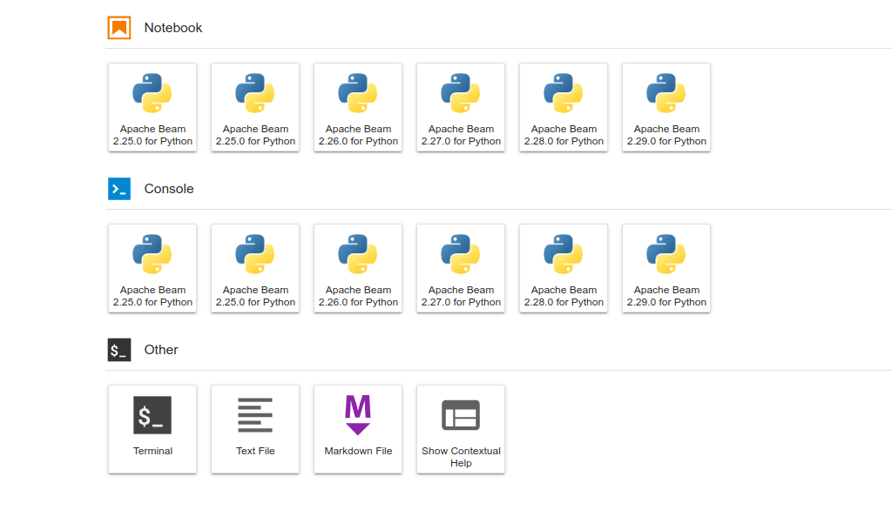

# Demo: Beam Notebooks and Dataframes API

Goal: Show how to use Beam Notebooks for interactive development of pipelines and use the Dataframes API

## Demo Setup and Notes

To set up this demo, you will need to create a Dataflow Notebooks environment and clone the training-data-analyst repo. This can be done in advance of the demo for the sake of time, but should only take a couple of minutes if done live. 

To create the Dataflow Notebooks environment go to the Google Cloud Console, click on the main menu, and then go to **Dataflow > Workbench**. Once in the Dataflow Notebooks UI, click on **New Instance** and select **Apache Beam > Without GPUs**. You do not need to edit anything else about the instance, but just need to click **Create**.

Once the notebook is ready, you can click on **Open JupyterLab** to tunnel into the JupyterLab interface.


Once in the notebook interface, on the Launcher select **Terminal**. 



In the new terminal session run the following commands to clone the repo,

```bash
cd home/jupyter
git clone https://github.com/GoogleCloudPlatform/training-data-analyst.git
```

Once the repo is cloned, in the file browser go to **training-data-analyst > courses > dataflow > demos > beam_notebooks** and open the **beam_notebooks_demo.ipynb** file. When asked, select **Apache Beam 2.40.0 for Python 3** as the kernel.

Step through the notebook cell by cell to finish the demo!

**Note**: Be sure to run the notebook cell by cell and not run the entire notebook in advance. One of the cells is supposed to return an error to discuss a certain concept.
